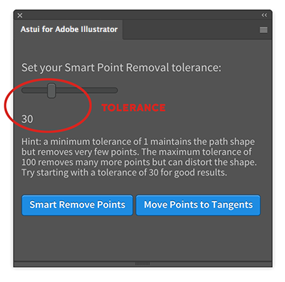

# Astute Graphics API Demo Extension
This CEP extension for Adobe Illustrator demonstrates how to build extensions to interact with the Astui API for _Smart Remove Point_ and _Move Points to Tangents_.

## Installation

If you are not installing this extension via the Adobe Exchange marketplace, and have downloaded it to your computer, we recommend [Anastasiy's Extension Manager](https://install.anastasiy.com/). Simply download the Extension Manager and follow the instructions.

You will need an API Token in order to use this extension. You may obtain an API Token by writing to [enquiries@astutegraphics.com](mailto:enquiries@astutegraphics.com)

## Smart Remove Point

Vector paths are comprised of points. The more points a path has, the bigger the file. But many of the points are not necessary to define the path. _Smart Remove Point_ removes the unnecessary points while maintaining the look of the path.

### Tolerance

The tolerance tells Astui how strict to be when removing points. A lower value means fewer points will be removed but the path will be changed less. A higher value means more points will be removed but the shape of the path might change a bit. We recommend starting with a value of 30 and adjusting to suit your preferences.

## Move Points to Tangents

When drawing paths, it is best to place points on the tangents, or the outermost edge of the curve. Think of tangents as if you were drawing a straight line whose length will touch the curve of the circle at just a single point, perpendicular (at a 90° angle) to a line extending straight out from the center of the circle. This is the tangent. 

_Move Points to Tangents_ will move the points on a path to the closest tangent.

## About the author

This extension was written by Scott Lewis, a digital illustrator, icon designer, and software developer - yes, an odd combination. You can learn more about Scott's illustration and development work on his sites [Atomic Lotus](https://atomiclotus.net) and [Vector Icons](https://vectoricons.net).

## About the Astui API

_*Astui*_ is the web-based REST API version of Astute Graphics' leading Adobe Illustrator plugin technology, AGTech. You can learn more about Astui from [the Astute Graphics website](https://astutegraphics.com/tech/sdk-web-api/) or by emailing [enquiries@astutegraphics.com](mailto:enquiries@astutegraphics.com)
                

